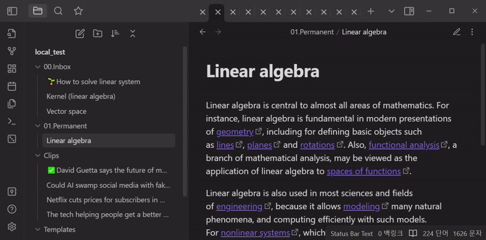

# Emoji Titler

Emoji Titler is a plugin for [Obsidian](https://obsidian.md/) that allows you to quickly add an emoji to the title of the active note using keyboard shortcuts.

## Usage

Emoji Titler allows you to set up to 9 custom emojis, each of which can be assigned to a number key (1-9) on your keyboard. The default keyboard shortcut to add an emoji to the title is `Ctrl+Shift+[number key]`. The delete shortcut is `Ctrl+Shift+-`. If you want to modify the shortcuts, filter the Obsidian shortcut settings by `Emoji Titler` and modify the corresponding keybindings.

To assign specific emojis to number keys, navigate to the Emoji Titler plugin settings and assign the desired emojis to numbers 1 through 9. These assigned emojis can then be inserted into the beginning of the note title by pressing the corresponding shortcuts.

In addition to adding emojis, Emoji Titler also allows you to delete emojis from the beginning of the title. If the first character of the title is one of the assigned emojis, pressing `Ctrl+Shift+-` will remove that emoji from the title.

## Installation

The easiest way to install Emoji Titler is to search for `Emoji Titler` in the Community Plugins tab of the Obsidian settings.

Alternatively, you can manually install the plugin by downloading the latest release from the [GitHub releases](https://github.com/hyeonseonam/obsidian-emoji-titler/releases) page and extracting the ZIP file to your Obsidian plugins folder.

## Support

If you encounter any issues while using this plugin or have any suggestions for improvement, please feel free to submit an issue on the GitHub repository. Pull requests are also welcome.
## License

MIT License